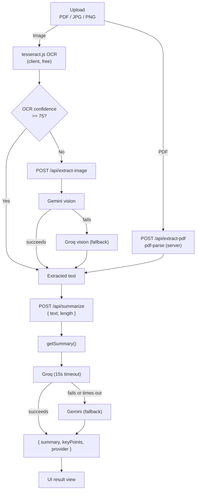

# DocSum

Upload a PDF, JPG, or PNG and get an AI-generated summary with key points in seconds.

## Features

- Drag-and-drop or click-to-browse file upload (PDF / JPG / PNG, 10MB max), with client-side validation
- PDF text extraction on the server (`pdf-parse`)
- Image OCR in the browser (`tesseract.js`) by default: no server round trip, no API key. If Tesseract's own confidence score comes back low (e.g. dense tables, small text), the image is automatically re-read by a vision-capable Gemini/Groq call for accuracy
- Summarization with a Groq primary provider and an automatic Gemini fallback
- Markdown tables in a summary render as real tables, on screen, in copy, and in the print/PDF export
- Adjustable summary length (short / medium / long), with in-place regeneration from an existing extraction
- Copy-to-clipboard (rich table formatting included), "Powered by Gemini/Groq" tag, and clear error states for every failure mode

## Tech Stack

Next.js 14 (App Router, TypeScript), Tailwind CSS, `pdf-parse`, `tesseract.js`, `@google/generative-ai` (Gemini `gemini-flash-lite-latest`, text and vision), `groq-sdk` (`openai/gpt-oss-120b` for text, `qwen/qwen3.6-27b` for vision). Deployed on Vercel.

## Getting Started

1. **Install dependencies**

   ```bash
   npm install
   ```

2. **Add API keys locally**

   Copy the example env file and fill in your own keys:

   ```bash
   cp .env.example .env.local
   ```

   - `GEMINI_API_KEY`: get one from [Google AI Studio](https://aistudio.google.com/app/apikey)
   - `GROQ_API_KEY`: get one from [Groq Console](https://console.groq.com/keys)

   `.env.local` is gitignored and never committed.

3. **Run the dev server**

   ```bash
   npm run dev
   ```

   Open [http://localhost:3000](http://localhost:3000).

## Deploying to Vercel

1. Import this repository into Vercel.
2. In **Project Settings → Environment Variables**, add `GEMINI_API_KEY` and `GROQ_API_KEY` for both the Production and Preview environments.
3. Deploy. No build configuration changes are needed.

Note: the `/api/summarize` route sets `maxDuration = 30` to leave enough headroom for the 15-second Groq timeout plus a Gemini fallback round trip. Vercel's Hobby plan caps function duration at 10 seconds regardless of this setting. On Hobby, a slow Groq response followed by a Gemini fallback can occasionally time out. Upgrading to Pro (or higher) honors the 30-second setting.

## Architecture Overview



Only low-confidence images make the extra round trip: Tesseract's own confidence score decides whether the (free, client-side) result is trusted as-is or re-read by a vision model, so the common case stays free and keyless.

The UI is a single client component (`DocSumApp`) driven by one `useReducer` state machine with five states: `idle → extracting → summarizing → result`, with `error` reachable from any step. Presentational components (`UploadZone`, `LengthSelector`, `ProgressSpinner`, `ResultView`, `ErrorBanner`) are stateless and controlled entirely by props.

## Why Groq + Gemini Fallback

Groq's hosted GPT-OSS 120B is the primary provider: consistently fast (typically well under a second for a summary) and good at following the structured JSON format we ask for. But any hosted API can throw, rate-limit, or hang, and a document summarizer that just shows an error the moment that happens isn't reliable enough to actually use. Gemini Flash is the backup: if Groq errors, returns a 429, or doesn't respond within 15 seconds, the app automatically retries the same request against Gemini with an equivalent prompt, and tells the user which provider actually served the summary. This order was chosen deliberately after Gemini's available flash-tier model proved to be a slower "thinking" model that regularly took 7+ seconds even on trivial input, whereas Groq's response times stayed consistently fast, so Groq leads and Gemini serves as backup capacity rather than the default path.

## Approach

The two extraction paths landed on opposite sides of the client/server boundary for a reason: `pdf-parse` depends on Node APIs, so it only runs server-side, while `tesseract.js` runs entirely in the browser via WebAssembly, keeping OCR free and keyless for the common case. Tesseract genuinely struggles with dense or tabular images, though, so rather than replacing it outright, a confidence check escalates only the images Tesseract itself is unsure about to a vision-capable Gemini/Groq call, keeping cost proportional to how often it's actually needed. Summarization is centralized behind a single `getSummary()` function so the Groq-then-Gemini fallback, the 15-second timeout, and provider logging all live in one place; a route handler just needs a result or an error back. Both providers are asked for strict JSON (via each SDK's native JSON mode) rather than parsed out of free-form prose, since a mode the API itself enforces is a far more reliable contract than prompt-engineered formatting; a regex fallback parser is kept as a last resort. The upload UI is hand-rolled HTML5 drag-and-drop instead of a dependency, since one drop zone and one file input isn't enough surface area to justify a library. The biggest tradeoff is state management: a single `useReducer` in one top-level component keeps the flow easy to reason about at the cost of that component knowing about every step, which is fine at this size but wouldn't scale to something more branching.

## Known Limitations

- **Vercel body size limit**: the app validates files up to 10MB client-side, but Vercel's serverless functions cap request bodies at roughly 4.5MB. Files larger than that will fail with a 413 when uploaded to `/api/extract-pdf`, or to `/api/extract-image` on a low-confidence image, even though local validation passed.
- **tesseract.js requires network access**: OCR fetches its worker, core, and language data from a CDN (jsDelivr) at runtime. A restrictive network (e.g. a corporate firewall) can block this and cause OCR to fail.
- **Low-confidence images cost an extra API call**: images where Tesseract's confidence falls below the threshold are re-read by a vision-capable Gemini/Groq call, which is no longer free or keyless for that image. This is a deliberate deviation from the original "tesseract.js only" spec, scoped to only the images that need it.
- **Scanned/image-only PDFs aren't supported**: `pdf-parse` only extracts embedded text layers; a PDF that's just a scanned image with no text layer will return no extractable text.
- **English-only OCR**: images are OCR'd with the English (`eng`) language pack only, no auto-detection or language selection.
- **No persistence**: summaries live only in the current browser session and aren't saved anywhere.
- **Hobby-plan timeout risk**: see the deployment note above. The Groq timeout plus Gemini fallback can exceed Vercel Hobby's 10-second function limit on a slow request.

## Environment Variables

| Variable | Required | Used by | Where to get it |
|---|---|---|---|
| `GEMINI_API_KEY` | Yes | `/api/summarize` (fallback), `/api/extract-image` (primary) | [Google AI Studio](https://aistudio.google.com/app/apikey) |
| `GROQ_API_KEY` | Yes | `/api/summarize` (primary), `/api/extract-image` (fallback) | [Groq Console](https://console.groq.com/keys) |

Both are read server-side only and are never exposed to the client.
